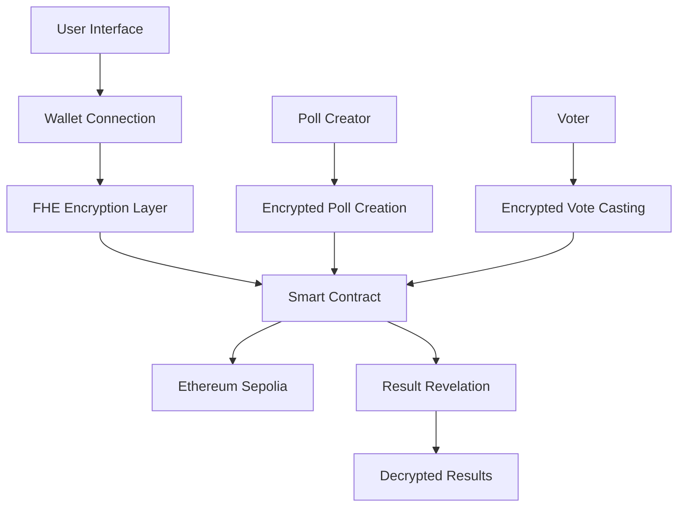

<div align="center">

# 🗳️ Secret Poll Verse

### *Where Privacy Meets Democracy*

[](https://opensource.org/licenses/MIT)
[](https://www.typescriptlang.org/)
[](https://reactjs.org/)
[](https://ethereum.org/)
[](https://www.zama.ai/)

*Revolutionary anonymous polling powered by Fully Homomorphic Encryption*

[🚀 Live Demo](#) • [📖 Documentation](#) • [🐛 Report Bug](#) • [💡 Request Feature](#)

</div>

---

## 🌟 What Makes Us Different?

In a world where voting patterns can be manipulated and privacy is compromised, **Secret Poll Verse** introduces a paradigm shift. Our platform leverages cutting-edge **Fully Homomorphic Encryption (FHE)** technology to ensure that your vote remains completely private until the poll concludes.

### 🔐 The Privacy Revolution

```
Traditional Polling: Vote → Visible → Influenced
Secret Poll Verse:  Vote → Encrypted → Anonymous → Authentic
```

## ✨ Key Features

<table>
<tr>
<td width="50%">

### 🛡️ **Zero-Knowledge Voting**
- Votes encrypted with FHE technology
- No intermediate results revealed
- Complete anonymity guaranteed

### 🔗 **Web3 Native**
- Seamless wallet integration
- Decentralized architecture
- Transparent and verifiable

</td>
<td width="50%">

### ⚡ **Real-time Experience**
- Instant poll creation
- Live voting interface
- Dynamic result revelation

### 🎨 **Modern Design**
- Intuitive user interface
- Responsive across devices
- Dark theme optimized

</td>
</tr>
</table>

## 🏗️ Architecture Overview



## 🚀 Quick Start

### Prerequisites

- **Node.js** ≥ 18.0.0
- **npm** or **yarn**
- **Web3 Wallet** (MetaMask, Rainbow, etc.)

### Installation

```bash
# Clone the repository
git clone https://github.com/juliarojas9/secret-poll-verse.git
cd secret-poll-verse

# Install dependencies
npm install

# Set up environment variables
cp .env.example .env

# Start development server
npm run dev
```

### Environment Configuration

Create a `.env` file with the following variables:

```env
# Blockchain Configuration
NEXT_PUBLIC_CHAIN_ID=11155111
NEXT_PUBLIC_RPC_URL=your_rpc_url_here

# Wallet Connect
NEXT_PUBLIC_WALLET_CONNECT_PROJECT_ID=your_project_id_here

# Contract Addresses (after deployment)
NEXT_PUBLIC_POLL_CONTRACT_ADDRESS=your_contract_address_here
NEXT_PUBLIC_FHE_CONTRACT_ADDRESS=your_fhe_contract_address_here
```

## 🎯 Usage Guide

### For Poll Creators

1. **Connect Wallet** → Link your Web3 wallet
2. **Create Poll** → Define question and options
3. **Set Duration** → Choose poll timeframe
4. **Deploy** → Poll goes live with FHE encryption

### For Voters

1. **Browse Polls** → View active polls
2. **Connect Wallet** → Authenticate your identity
3. **Cast Vote** → Select option (encrypted)
4. **Wait for Results** → Results revealed after closure

## 🔧 Technology Stack

<div align="center">

| Category | Technology | Purpose |
|----------|------------|---------|
| **Frontend** | React 18 + TypeScript | Modern UI framework |
| **Styling** | Tailwind CSS + shadcn/ui | Responsive design system |
| **Build Tool** | Vite | Fast development & build |
| **Blockchain** | Ethereum Sepolia | Decentralized network |
| **Wallet** | RainbowKit + Wagmi | Web3 integration |
| **Encryption** | Zama FHE | Privacy preservation |
| **State** | TanStack Query | Data management |

</div>

## 🏛️ Smart Contract Features

Our FHE-enabled smart contract provides:

- **Encrypted Vote Storage**: All votes stored in encrypted form
- **Homomorphic Counting**: Vote aggregation without decryption
- **Access Control**: Secure poll management
- **Result Revelation**: Controlled result disclosure

## 📦 Project Structure

```
secret-poll-verse/
├── 🏗️ contracts/           # Smart contracts
│   └── SecretPollVerse.sol
├── 🎨 src/
│   ├── components/         # React components
│   ├── hooks/             # Custom hooks
│   ├── lib/               # Utilities
│   └── pages/             # Page components
├── 📚 docs/               # Documentation
├── 🚀 public/             # Static assets
└── ⚙️ config files        # Configuration
```

## 🚀 Deployment

### Vercel (Recommended)

[](https://vercel.com/new/clone?repository-url=https://github.com/juliarojas9/secret-poll-verse)

1. **Fork Repository** → Create your own copy
2. **Connect to Vercel** → Link your GitHub account
3. **Configure Environment** → Set up variables
4. **Deploy** → One-click deployment

### Manual Deployment

```bash
# Build for production
npm run build

# Preview build
npm run preview

# Deploy to your preferred platform
```

## 🤝 Contributing

We welcome contributions! Here's how you can help:

### 🐛 Bug Reports
- Use GitHub Issues
- Provide detailed reproduction steps
- Include environment information

### 💡 Feature Requests
- Describe the feature clearly
- Explain the use case
- Consider implementation complexity

### 🔧 Development

```bash
# Fork the repository
git clone your-fork-url
cd secret-poll-verse

# Create feature branch
git checkout -b feature/amazing-feature

# Make changes and test
npm run dev
npm run build

# Commit and push
git commit -m "Add amazing feature"
git push origin feature/amazing-feature

# Create Pull Request
```

## 📊 Roadmap

- [ ] **Q1 2024**: Mainnet deployment
- [ ] **Q2 2024**: Mobile app development
- [ ] **Q3 2024**: Advanced analytics
- [ ] **Q4 2024**: Multi-chain support

## 🛡️ Security

Security is our top priority:

- **Smart Contract Audits**: Regular security reviews
- **FHE Implementation**: Battle-tested encryption
- **Access Controls**: Multi-layer security
- **Privacy by Design**: No data collection

## 📄 License

This project is licensed under the **MIT License** - see the [LICENSE](LICENSE) file for details.

## 🙏 Acknowledgments

- **Zama** for FHE technology
- **Ethereum Foundation** for blockchain infrastructure
- **Open Source Community** for amazing tools and libraries

## 📞 Support & Community

<div align="center">

[](https://github.com/juliarojas9/secret-poll-verse/issues)
[](https://github.com/juliarojas9/secret-poll-verse/stargazers)
[](https://github.com/juliarojas9/secret-poll-verse/network)

**Need help?** [Open an issue](https://github.com/juliarojas9/secret-poll-verse/issues) or [start a discussion](https://github.com/juliarojas9/secret-poll-verse/discussions)

---

<div align="center">

**Made with ❤️ by the Secret Poll Verse Team**

*Empowering democracy through privacy-preserving technology*

</div>